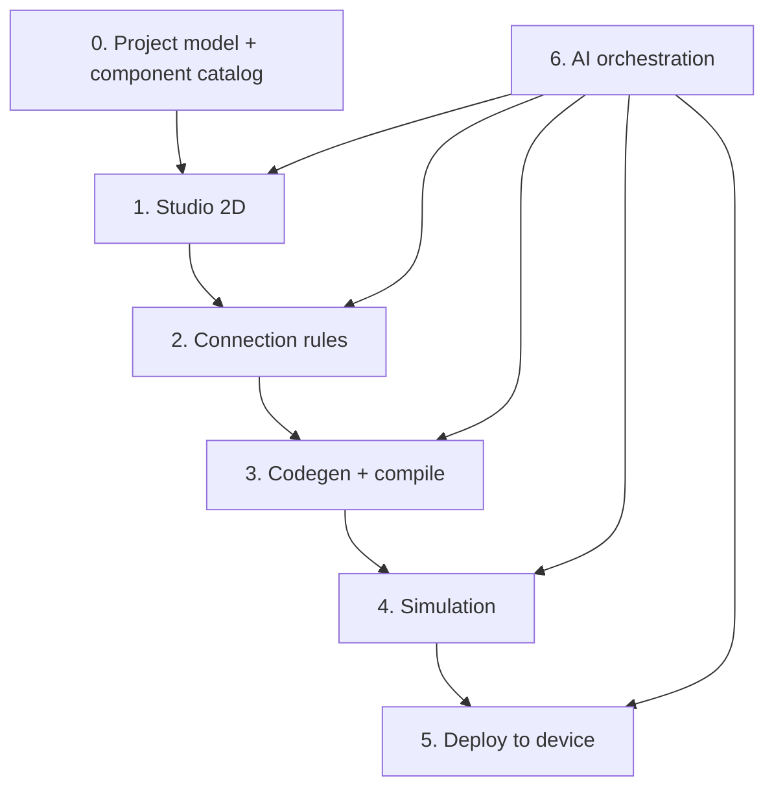

# Berry Build Plan

Living roadmap for `app.berry.studio`. Check items off as each stage ships. Update **Current phase** when you move forward.

**Product goal:** Talk to AI → design in Studio → validate wiring → simulate firmware → deploy the same build to a real device.

**Current phase:** Phase 6 — AI build loop demo (Phase 5 deploy intentionally deferred)

**Last updated:** 2026-06-12

---

## How the pieces connect



**Principle:** One canonical `project.json` is the source of truth. The format is **3D-native** (`xyz` on positions and wire points); 2D Studio uses **x/y only** (`z: 0`). See [docs/project-schema.md](./docs/project-schema.md).

---

## Progress overview

| Phase | Name | Status |
|-------|------|--------|
| — | Repo bootstrap & brand | Done |
| 0 | Foundation | Done |
| 1 | Studio 2D | Done |
| 2 | Functional wiring / validation | Done |
| 3 | Codegen + compile | Done |
| 4 | Simulation | Demo-ready (mock contract shipped) |
| 5 | Deploy to device | Deferred (show coming soon) |
| 6 | AI build loop | In progress (video-first demo) |
| 7 | 3D + advanced sim (optional) | Not started |

---

## Repo bootstrap & brand (done)

- [x] Next.js app scaffold (`berry-app`)
- [x] Brand tokens, logo, icon (`src/lib/brand.ts`, `public/`)
- [x] Agent context (`AGENTS.md`, `.cursor/rules/berry-brand.mdc`)
- [x] Branded landing / brand reference page

---

## Phase 0 — Foundation

**Outcome:** Serializable project model and starter component catalog. No canvas yet.

- [x] Define `BerryProject` schema (3D transforms, components, nets, wires, metadata, board)
- [x] Define `ComponentDefinition` schema (terminals, kinds, voltage, capabilities)
- [x] Define `Net` + `Wire` model (electrical nets + 3D wire polylines)
- [x] Ship starter catalog (ESP32, UNO, breadboard, LED, resistors, HC-SR04, BME280, servo, LCD, button)
- [x] Project import/export JSON (`src/lib/project/io.ts`)
- [x] Board profiles (`esp32-devkit-v1`, `arduino-uno`)
- [x] Document schema in `docs/project-schema.md` + `examples/esp32-led-blink.project.json`
- [x] Unit tests for `src/lib/project/` (`pnpm test:run`)

**Exit criteria:** Can hand-write or generate a valid `project.json` and load it without Studio UI.

---

## Phase 1 — Studio (2D)

**Outcome:** Drag-and-drop schematic editor backed by the project graph.

- [x] React Flow (or equivalent) canvas
- [x] Component tray from catalog
- [x] Place, move, delete components
- [x] Wire mode: connect pin A → pin B (updates graph nets)
- [x] Undo / redo
- [x] Persist project to storage (local first, cloud later)
- [x] Empty / loading / error states

**Exit criteria:** User can build a schematic visually; saved file round-trips through load.

**Defer:** 3D breadboard view until Phase 7.

---

## Planned Studio UX (not scheduled yet)

Items to ship **after** a project **folder / file menu** exists (list of project files — firmware, config, docs, generated artifacts, etc.). Same `BerryProject` JSON remains the source of truth; these are additional views and files in the tree.

| Item | Description |
|------|-------------|
| **Project folder menu** | Sidebar or panel listing all files in the hardware project (e.g. `project.json`, sketch, `platformio.ini`, README, wiring export). Prerequisite for diagram + doc tabs. |
| **Wiring diagram view** | Board-centric schematic (reference: ESP32 pin column in the center, peripheral cards around it, color-coded orthogonal wires, pin labels like `TRIG → GPIO27`, short part descriptions). Read-only or lightly editable renderer over `components` + `nets` + `wires` + `project.board` — not a second schema. Complements the 2D breadboard bench; good for review, AI explanation, and validation overlays (Phase 2). |

**Likely placement:** Folder menu first; wiring diagram as a file/tab (e.g. `wiring.diagram` or in-app **Bench \| Diagram** toggle) once the file tree ships.

---

## Phase 2 — Functional wiring (validation)

**Outcome:** Know what can connect to what before simulation or deploy.

- [x] Breadboard row/column placement (`placement.sites`, tie groups, snap on move)
- [x] Fix breadboard hole snapping with per-terminal placement and selected-hole overlays
- [x] Pin type system (`power`, `ground`, `gpio`, `i2c`, `uart`, etc.) — catalog + validation context
- [x] Kind / voltage matching rules (`net-power`: shorts, voltage mismatch)
- [x] Warnings (LED without resistor; more rules deferred)
- [x] I2C / UART pairing checks, conservative pin-kind compatibility, unpowered module warnings, and floating button input warnings
- [x] `ValidationResult[]` with `error | warning | info` + stable codes
- [x] Inline errors on wires and pins in Studio
- [x] Block “Build” / “Deploy” when errors exist
- [x] Connect-time feedback when a new wire would introduce a validation error
- [x] Clickable validation rows for net-level findings
- [x] API: `validate(project)` for AI and UI (`POST /api/validate`)

**Exit criteria:** Invalid wiring surfaces immediately in Studio; validation API is testable without LLM.

---

## Phase 3 — Codegen + compile

**Outcome:** Graph → firmware for a chosen board; compiler errors surfaced in app.

- [x] Pick first target board (ESP32 devkit + Arduino UNO in compile pipeline)
- [x] Browser firmware editor for `src/main.cpp`
- [x] Graph → sketch / PlatformIO tree (`generateFirmwareFromProject`, toolbar **Generate**)
- [x] Pin map from graph to board pins in generated code (`buildProjectPinMap`)
- [x] Compile pipeline (`BERRY_BUILD_BACKEND`: PlatformIO local, mock, remote stub)
- [x] Show compiler errors in build output panel
- [x] Build artifact: `.bin` / `.hex` + metadata hash + download cache
- [x] API: `POST /api/build`, `POST /api/codegen`, `GET /api/build/artifact`

**Exit criteria:** Valid project compiles for target board; failures are actionable.

---

## Phase 4 — Simulation

**Outcome:** Verify firmware behavior against the graph before touching hardware.

**Scope tiers (ship incrementally):**

| Tier | What it does |
|------|----------------|
| L1 | Validation only (Phase 2) |
| L2 | Compile succeeds |
| L3 | Emulated GPIO + mocked peripherals + serial logs |
| L4 | Richer per-component behavior models |

- [x] Define simulation pass/fail contract (`status`, `logs`, `errors`, `firmwareHash`)
- [x] Implement L2 + L3 mock for **one** board + **one** demo circuit (ESP32 LED blink)
- [x] Serial / monitor output in Studio UI
- [x] API: `simulate(project, artifact)` → result (`POST /api/simulate`)
- [x] Document what is emulated vs mocked vs not simulated (see note below)

**Exit criteria:** Demo circuit passes sim with expected serial output; same artifact hash used for deploy.

**Note:** Full in-browser ESP32 emulation is hard; prefer mocked peripherals + compile-verify early. Evaluate Wokwi-style integration vs custom emulator as a deliberate decision.

**Current simulator (2026-06-12):** Mock-heavy contract only — `simulateProject` requires a successful build `firmwareHash`, returns deterministic serial logs and GPIO traces for the **ESP32 and Arduino Uno** LED blink circuits, and reports `unsupported` for other circuits. Real GPIO/peripheral behavior models and bytecode execution remain TODO before deploy can rely on rich emulation.

---

## Phase 5 — Deploy to device

**Outcome:** Flash the **same** artifact that passed simulation.

**Status:** Deferred until after the AI integration video. In Studio, Deploy should remain visible but show a clear “coming soon” message when clicked.

- [ ] Deploy uses identical build artifact as sim (`firmwareHash` match)
- [ ] Web Serial: connect, monitor logs in Studio
- [ ] Flash path for chosen board (Web Serial bootloader and/or thin `berry-cli` agent)
- [ ] Post-flash verification (device responds, expected boot log)
- [ ] API: `deploy(project, artifact, deviceId)` → result + log stream
- [ ] Error handling: wrong port, permission denied, flash failed

**Exit criteria:** End-to-end on one board: sim pass → plug in device → flash → see live serial output.

---

## Phase 6 — AI build loop

**Outcome:** User talks to AI; agents mutate project via tools, then validate → build → simulate. Deploy remains a coming-soon handoff until Phase 5 resumes.

**Design:** See [docs/agent-architecture.md](./docs/agent-architecture.md) for the multi-agent workflow, clarification loop, tool boundaries, and wiring-guide handoff.

- [x] Demo prompt box in Studio for “build me an ESP32 LED blink”
- [x] Scripted AI plan output: choose board, place parts, wire LED + resistor, generate firmware
- [x] Tool-first mutation layer for demo actions, not raw JSON edits
- [x] Core demo tools: `studio.add_component`, `studio.wire_pins`, `validate`, `codegen`, `build`, `simulate`
- [x] Guardrails: schema validation on every tool input/output
- [x] Timeline UI showing AI steps, tool calls, validation/build/sim status, and serial logs
- [x] Demo flow: natural language → wired project → generated firmware → build → passed simulation
- [x] Keep Deploy button visible as coming soon for the video
- [x] Board-aware AI build loop: ESP32 DevKit V1 **and** Arduino Uno LED blink as first-class targets
- [x] Board-aware reference intents (`esp32_led_blink`, `arduino_uno_led_blink`, `unsupported`)
- [x] Typed structured tool-call executor (`studio.set_board`, `studio.add_component`, `studio.connect_terminals`, `studio.move_component`, `project.validate`) with post-batch validation; no raw `project.json` edits

**Exit criteria:** One polished scripted “talk → design → build → simulate” demo without manual canvas edits, suitable for a short product video.

---

## Phase 7 — 3D & advanced simulation (optional)

- [ ] 3D breadboard view driven from same 2D graph (Three.js / R3F)
- [ ] Additional board support
- [ ] Richer peripheral models (I2C devices, PWM, analog warnings)
- [ ] Analog / power sanity checks (simplified, not full SPICE)

---

## Five pillars → phases

| # | Pillar | Primary phase(s) |
|---|--------|----------------|
| 1 | Studio (2D / 3D) | 1, 7 |
| 2 | Functional wiring | 2 |
| 3 | Simulation | 4 |
| 4 | Deploy browser → device | 5 |
| 5 | Build with AI | 6 (wraps 0–5 via tools) |

---

## Architecture decisions (resolve early)

| Decision | Options | Status |
|----------|---------|--------|
| First target board | ESP32 devkit vs Arduino UNO | **Resolved** — both supported (ESP32 default for unspecified LED blink) |
| Compile location | Cloud worker vs WASM vs local CLI | **Open** |
| Simulation strategy | Custom emulator vs integrate (e.g. Wokwi-inspired) vs mock-heavy MVP | **Open** |
| Deploy without native agent | Web Serial only vs `berry-cli` helper | **Open** |
| AI integration | LangGraph + internal APIs; MCP as adapter | Proposed |

---

## What not to build first

- Full 3D Studio before 2D graph works
- Full SPICE / analog simulation
- Cycle-accurate ESP32 in-browser
- LangChain agents before `validate` / `build` APIs exist
- LLM editing raw project JSON without schema validation

---

## Suggested code layout (as phases land)

```
src/lib/project/       # Phase 0 — schemas, catalog (done)
src/lib/validation/    # Phase 2 — rule engine
src/components/studio/ # Phase 1 — canvas UI; diagram view later
src/server/tools/      # Phases 3–6 — build, sim, deploy APIs
mcp-server/            # Phase 6 — optional MCP wrapper
```

---

## Changelog

| Date | Change |
|------|--------|
| 2026-06-03 | Initial build plan from product brainstorm |
| 2026-06-03 | Phase 0: 3D-native project schema, catalog, boards, io, example |
| 2026-06-03 | Phase 1: Studio 2D (`/studio`), mutations, React Flow, localStorage, undo/redo |
| 2026-06-03 | Planned: project folder menu + wiring diagram view (board-centric schematic) after file tree ships |
| 2026-06-05 | Phase 2 MVP: `src/lib/validation/`, Studio panel + overlays, Build/Deploy gate, `/api/validate` |
| 2026-06-09 | Phase 2 hardening: protocol pairing, pin compatibility, power/floating warnings, connect preflight, net-row selection, API route tests |
| 2026-06-11 | Phase 4 mock simulation: `src/lib/simulation/`, `POST /api/simulate`, Studio Simulate toolbar + panel |
| 2026-06-12 | Deferred Phase 5 deploy for video push; Phase 6 AI build loop becomes active demo track |
| 2026-06-12 | Phase 6 foundation: model registry, deterministic agent workflow, `/api/agent/run`, Studio AI panel, wiring guide |
| 2026-06-12 | Real AI provider path: OpenAI structured model client, agent schemas/prompts, model-backed clarifier/planner/circuit intent/wiring guide |
| 2026-06-12 | Phase 6 multi-board: ESP32 + Arduino Uno LED blink AI targets, board-aware reference intents, Arduino reference circuit + codegen + mock sim, typed tool-call executor with post-batch validation |
