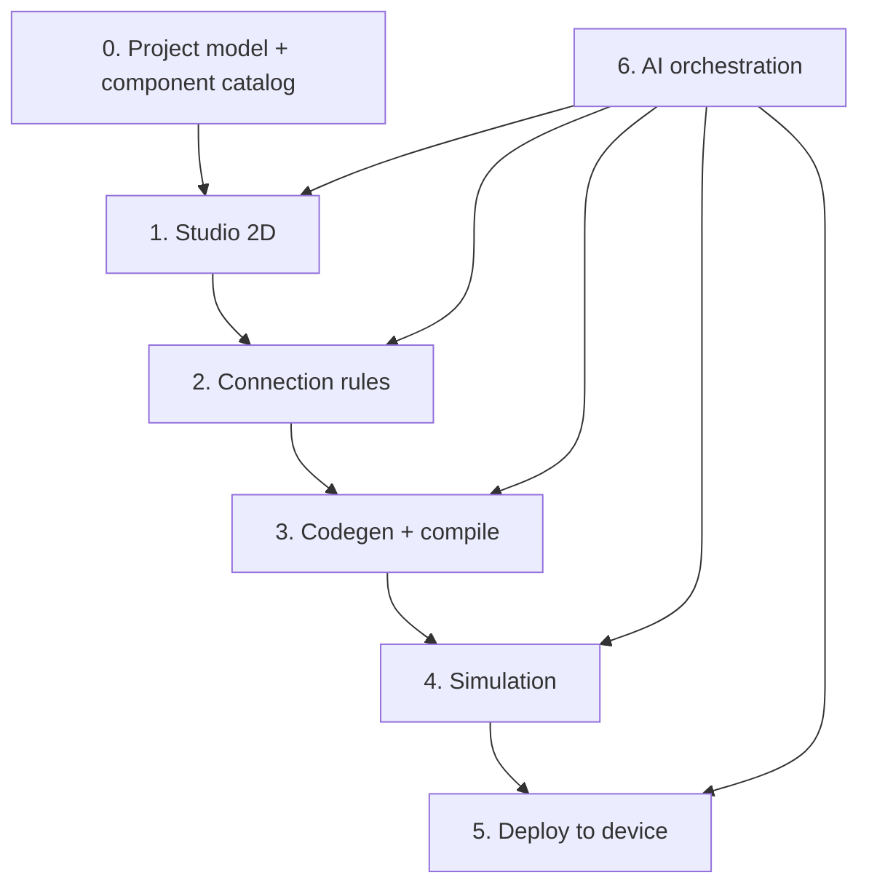

# Berry Build Plan

Living roadmap for `app.berry.studio`. Check items off as each stage ships. Update **Current phase** when you move forward.

**Product goal:** Talk to AI → design in Studio → validate wiring → simulate firmware → deploy the same build to a real device.

**Current phase:** Phase 0 — Foundation

**Last updated:** 2026-06-03

---

## How the pieces connect



**Principle:** One canonical `project.json` graph is the source of truth for Studio, validation, codegen, simulation, deploy, and AI tools.

---

## Progress overview

| Phase | Name | Status |
|-------|------|--------|
| — | Repo bootstrap & brand | Done |
| 0 | Foundation | In progress |
| 1 | Studio 2D | Not started |
| 2 | Functional wiring / validation | Not started |
| 3 | Codegen + compile | Not started |
| 4 | Simulation | Not started |
| 5 | Deploy to device | Not started |
| 6 | AI build loop | Not started |
| 7 | 3D + advanced sim (optional) | Not started |

---

## Repo bootstrap & brand (done)

- [x] Next.js app scaffold (`berry-app`)
- [x] Brand tokens, logo, icon (`src/lib/brand.ts`, `public/`)
- [x] Agent context (`AGENTS.md`, `.cursor/rules/berry-brand.mdc`)
- [x] Branded landing / brand reference page

---

## Phase 0 — Foundation

**Outcome:** Serializable project model and starter component catalog. No canvas yet.

- [ ] Define `Project` schema (components, nets, metadata, target board)
- [ ] Define `ComponentDefinition` schema (pins, kinds, voltage, protocols)
- [ ] Define `Net` / wire model (shared electrical node, not just canvas lines)
- [ ] Ship starter catalog (10–20 parts: ESP32 devkit, UNO, LED, resistor, button, BME280, etc.)
- [ ] Project import/export JSON (save/load)
- [ ] Board profiles (pin maps per board variant)
- [ ] Document schema in `docs/` or inline types + examples

**Exit criteria:** Can hand-write or generate a valid `project.json` and load it without Studio UI.

---

## Phase 1 — Studio (2D)

**Outcome:** Drag-and-drop schematic editor backed by the project graph.

- [ ] React Flow (or equivalent) canvas with snap-to-grid
- [ ] Component tray from catalog
- [ ] Place, move, delete components
- [ ] Wire mode: connect pin A → pin B (updates graph nets)
- [ ] Undo / redo
- [ ] Persist project to storage (local first, cloud later)
- [ ] Empty / loading / error states

**Exit criteria:** User can build a schematic visually; saved file round-trips through load.

**Defer:** 3D breadboard view until Phase 7.

---

## Phase 2 — Functional wiring (validation)

**Outcome:** Know what can connect to what before simulation or deploy.

- [ ] Pin type system (`power`, `ground`, `gpio`, `i2c`, `uart`, etc.)
- [ ] Kind / voltage / protocol matching rules
- [ ] Warnings (e.g. LED without resistor, floating inputs)
- [ ] `ValidationResult[]` with `error | warning | info` + stable codes
- [ ] Inline errors on wires and pins in Studio
- [ ] Block “Run” / “Deploy” when errors exist
- [ ] API: `validate(project)` for AI and UI

**Exit criteria:** Invalid wiring surfaces immediately in Studio; validation API is testable without LLM.

---

## Phase 3 — Codegen + compile

**Outcome:** Graph → firmware for a chosen board; compiler errors surfaced in app.

- [ ] Pick first target board (decision: ESP32 devkit **or** Arduino UNO)
- [ ] Graph → sketch / PlatformIO / ESP-IDF tree
- [ ] Pin map from graph to board pins in generated code
- [ ] Compile pipeline (cloud worker, WASM, or `arduino-cli` / local agent)
- [ ] Show compiler errors in panel + chat-friendly format
- [ ] Build artifact: `.bin` / `.hex` + metadata hash
- [ ] API: `build(project)` → artifact or errors

**Exit criteria:** Valid project compiles for target board; failures are actionable.

---

## Phase 4 — Simulation

**Outcome:** Verify firmware behavior against the graph before touching hardware.

**Scope tiers (ship incrementally):**

| Tier | What it does |
|------|----------------|
| L1 | Validation only (Phase 2) |
| L2 | Compile succeeds |
| L3 | Emulated GPIO + mocked peripherals + serial logs |
| L4 | Richer per-component behavior models |

- [ ] Define simulation pass/fail contract (`status`, `logs`, `errors`, `firmwareHash`)
- [ ] Implement L2 + L3 for **one** board + **one** demo circuit (e.g. blink LED, read mock sensor)
- [ ] Serial / monitor output in Studio UI
- [ ] API: `simulate(project, artifact)` → result
- [ ] Document what is emulated vs mocked vs not simulated

**Exit criteria:** Demo circuit passes sim with expected serial output; same artifact hash used for deploy.

**Note:** Full in-browser ESP32 emulation is hard; prefer mocked peripherals + compile-verify early. Evaluate Wokwi-style integration vs custom emulator as a deliberate decision.

---

## Phase 5 — Deploy to device

**Outcome:** Flash the **same** artifact that passed simulation.

- [ ] Deploy uses identical build artifact as sim (`firmwareHash` match)
- [ ] Web Serial: connect, monitor logs in Studio
- [ ] Flash path for chosen board (Web Serial bootloader and/or thin `berry-cli` agent)
- [ ] Post-flash verification (device responds, expected boot log)
- [ ] API: `deploy(project, artifact, deviceId)` → result + log stream
- [ ] Error handling: wrong port, permission denied, flash failed

**Exit criteria:** End-to-end on one board: sim pass → plug in device → flash → see live serial output.

---

## Phase 6 — AI build loop

**Outcome:** User talks to AI; agents mutate project via tools, then validate → build → sim → deploy.

- [ ] Tool-first APIs (all mutations through versioned tools, not raw JSON edits)
- [ ] Core tools: `studio.add_component`, `studio.wire_pins`, `validate`, `build`, `simulate`, `deploy`
- [ ] Orchestration backend (e.g. LangGraph): router, wiring, firmware, debug agents
- [ ] Guardrails: schema validation on every tool input/output
- [ ] MCP server exposing same tools (optional, for Cursor / external agents)
- [ ] Skills / `AGENTS.md` document how agents use tools safely
- [ ] Demo flow: natural language → working hardware on reference circuit

**Exit criteria:** One scripted “talk → build → sim → deploy” demo without manual canvas edits.

---

## Phase 7 — 3D & advanced simulation (optional)

- [ ] 3D breadboard view driven from same 2D graph (Three.js / R3F)
- [ ] Additional board support
- [ ] Richer peripheral models (I2C devices, PWM, analog warnings)
- [ ] Analog / power sanity checks (simplified, not full SPICE)

---

## Five pillars → phases

| # | Pillar | Primary phase(s) |
|---|--------|----------------|
| 1 | Studio (2D / 3D) | 1, 7 |
| 2 | Functional wiring | 2 |
| 3 | Simulation | 4 |
| 4 | Deploy browser → device | 5 |
| 5 | Build with AI | 6 (wraps 0–5 via tools) |

---

## Architecture decisions (resolve early)

| Decision | Options | Status |
|----------|---------|--------|
| First target board | ESP32 devkit vs Arduino UNO | **Open** |
| Compile location | Cloud worker vs WASM vs local CLI | **Open** |
| Simulation strategy | Custom emulator vs integrate (e.g. Wokwi-inspired) vs mock-heavy MVP | **Open** |
| Deploy without native agent | Web Serial only vs `berry-cli` helper | **Open** |
| AI integration | LangGraph + internal APIs; MCP as adapter | Proposed |

---

## What not to build first

- Full 3D Studio before 2D graph works
- Full SPICE / analog simulation
- Cycle-accurate ESP32 in-browser
- LangChain agents before `validate` / `build` APIs exist
- LLM editing raw project JSON without schema validation

---

## Suggested code layout (as phases land)

```
src/lib/project/       # Phase 0 — schemas, catalog
src/lib/validation/    # Phase 2 — rule engine
src/components/studio/ # Phase 1 — canvas UI
src/server/tools/      # Phases 3–6 — build, sim, deploy APIs
mcp-server/            # Phase 6 — optional MCP wrapper
```

---

## Changelog

| Date | Change |
|------|--------|
| 2026-06-03 | Initial build plan from product brainstorm |
