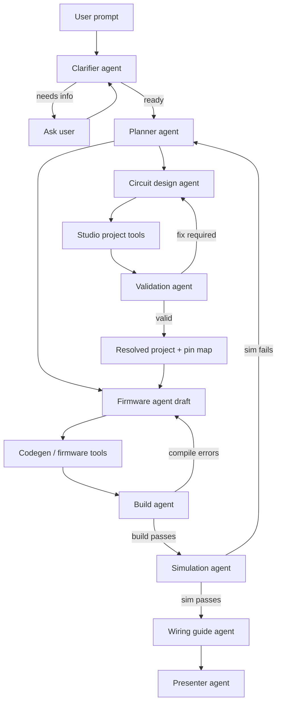

# Berry agent architecture

Phase 6 turns Berry from a manual Studio into an AI-guided hardware workbench. The goal is not to let one model freely rewrite `project.json`; the goal is to let specialized agents call safe Berry tools, validate every step, generate firmware from the final graph, and explain how to build the same circuit in real life.

This document describes the target architecture for the first proper multi-agent implementation.

## Product outcome

A user should be able to type:

> Build me an ESP32 blinking LED.

Berry should then:

1. Ask clarifying questions only when required.
2. Create or update the Studio project through tool calls.
3. Validate the circuit.
4. Generate firmware.
5. Build the firmware.
6. Simulate the result.
7. Produce a real-world wiring guide from the final validated project.
8. Show the whole process as a timeline in Studio.

Deploy remains a coming-soon handoff until Phase 5 resumes.

## Non-negotiable rules

- Agents must not directly edit raw `project.json`.
- Agents mutate projects through versioned tools backed by Berry's existing project mutation layer.
- The canonical `BerryProject` schema remains the source of truth.
- Validation runs after meaningful circuit mutations and before build or simulation.
- Firmware must be generated from the validated graph and resolved pin map, not from guessed prompt text.
- The wiring guide must be generated from the final validated project, not from the original user prompt.
- Every agent output that affects state must be structured and schema-validated.
- If the request is ambiguous in a way that changes parts, wiring, code behavior, or safety, the system asks the user before proceeding.

## Workflow



## Agent responsibilities

### Clarifier agent

Decides whether Berry has enough information to safely plan the build.

It should ask questions for prompts like:

- "Build me a temperature monitor." The display, sensor, board, and output format are unclear.
- "Make a motor controller." The motor type, voltage, driver, and power supply matter.
- "Use my sensor." The part is unspecified.

It should proceed with assumptions for prompts like:

- "Build me an ESP32 blinking LED."
- "Make the starter LED blink every half second."

Output:

```ts
type ClarificationResult =
  | {
      status: 'ready'
      normalizedGoal: string
      assumptions: string[]
    }
  | {
      status: 'needs_clarification'
      questions: ClarifyingQuestion[]
    }
```

Question guidance:

- Ask at most three questions at a time.
- Prefer questions that unblock parts, wiring, voltage, or behavior.
- Do not ask for details Berry can infer from available catalog defaults.
- Record assumptions so the Presenter can show them.

### Planner agent

Turns the clarified user goal into a build plan.

Output example:

```json
{
  "goal": "ESP32 LED blink",
  "board": "esp32-devkit-v1",
  "components": [
    { "type": "breadboard-full", "role": "bench" },
    { "type": "esp32-devkit-v1", "role": "controller" },
    { "type": "led-5mm", "role": "indicator" },
    { "type": "resistor-220", "role": "current limiter" }
  ],
  "behavior": {
    "kind": "blink",
    "intervalMs": 500
  },
  "constraints": [
    "Use a GPIO-safe current-limiting resistor.",
    "Keep all 2D coordinates at z = 0."
  ]
}
```

The Planner owns task ordering. It does not place components, connect terminals, or write firmware directly.

### Circuit design agent

Converts the build plan into Studio tool calls.

It decides:

- which catalog parts to add
- where to place them
- which terminals to connect
- which breadboard holes to use when placement matters
- how to respond to validation errors

It uses Berry tools rather than raw JSON edits:

```ts
studio.set_board({ board: 'esp32-devkit-v1' })
studio.add_component({ type: 'led-5mm', id: 'led_1', x: 0.42, y: 0.25 })
studio.add_component({ type: 'resistor-220', id: 'res_1', x: 0.35, y: 0.25 })
studio.connect_terminals({
  from: { componentId: 'esp32_1', terminalId: 'IO23' },
  to: { componentId: 'res_1', terminalId: 'pin1' },
  wire: { color: 'yellow', type: 'jumper-mf' }
})
```

Implementation should wrap current repo functions such as:

- `addComponent`
- `moveComponent`
- `setComponentTerminalSite`
- `setWireBreadboardEndpoint`
- `connectTerminals`
- `removeComponent`
- `removeWire`
- `replaceProject`

Circuit rules:

- Prefer common board-safe GPIO pins for first demos.
- For LEDs, include a current-limiting resistor.
- Keep `position.z`, `wire.points[].z`, and 2D-only rotations at `0`.
- Use catalog terminal ids exactly as defined in `src/lib/project/catalog.ts`.
- Use board ids exactly as defined in `src/lib/project/types.ts`.
- Treat `nets` as electrical truth and `wires` as visual rendering.

### Validation agent

Runs validation and converts findings into repair instructions.

Uses:

```ts
validate(project)
hasValidationErrors(results)
```

Responsibilities:

- Block build when validation has errors.
- Feed fixable circuit errors back to the Circuit design agent.
- Preserve warnings and info messages for the final guide.
- Never suppress validation findings for the sake of a prettier demo.

Validation output should be normalized for agents:

```ts
interface AgentValidationSummary {
  ok: boolean
  errors: string[]
  warnings: string[]
  suggestedFixes: AgentCircuitFix[]
}
```

### Firmware agent

Generates or edits firmware for the validated circuit.

It should receive:

- final `BerryProject`
- validated board id
- resolved pin map from codegen helpers
- desired behavior from the plan
- validation summary

For the first implementation, it can call Berry's deterministic codegen:

```ts
generateFirmwareFromProject(project)
```

Later, it can propose edits to `src/main.cpp`, but those edits must still pass build.

Rules:

- Do not invent board pins from prompt text.
- Use the resolved pin map.
- Keep serial output useful for simulation and real-world debugging.
- If build fails, respond to compiler diagnostics and retry within a bounded loop.

### Build agent

Runs the build pipeline and summarizes diagnostics.

Uses:

- `POST /api/build`
- or server-side `compileFirmware`

Responsibilities:

- Ensure validation has passed first.
- Ensure firmware source exists.
- Return artifact metadata, especially `firmwareHash`.
- Send compile errors back to the Firmware agent with file, line, and message.

### Simulation agent

Runs simulation against the same build artifact hash.

Uses:

- `POST /api/simulate`
- or server-side `simulateProject`

Responsibilities:

- Ensure build artifact exists.
- Ensure `artifact.firmwareHash` matches the current project and firmware files.
- Compare result against expected behavior from the plan.
- Send failures back to the Planner or Firmware agent.

### Wiring guide agent

Generates the human handoff after project JSON and firmware are finalized.

Important: this agent reads the final validated graph. It does not generate instructions from the original prompt alone.

Output sections:

- Parts list
- Board and firmware target
- Pin-by-pin wiring
- Breadboard placement notes
- Power and voltage notes
- Firmware behavior
- Expected serial output
- Troubleshooting
- Current limitations, including Deploy coming soon

Example:

```md
Parts:
- ESP32 DevKit V1
- 1 LED
- 220 ohm resistor
- Breadboard
- Jumper wires

Wiring:
1. Connect ESP32 GND to the breadboard ground rail.
2. Connect GPIO23 to one side of the 220 ohm resistor.
3. Connect the other side of the resistor to the LED anode.
4. Connect the LED cathode to GND.

Expected behavior:
The LED blinks every 500 ms. The serial monitor prints the LED state.
```

Guide rules:

- Use board labels that match the board profile.
- Name component ids only when useful for debugging.
- Include resistor and polarity notes for LEDs.
- Include voltage warnings for sensors and modules.
- Mention validation warnings if they remain.

### Presenter agent

Turns the agent run into a Studio timeline.

It should show:

- user goal
- assumptions
- clarifying questions and answers
- tool calls
- validation status
- firmware generation
- build status
- simulation status
- final wiring guide

The Presenter should be optimistic and practical, but not hide failures.

## Parallel and sequential work

Can run in parallel:

- Planner can produce circuit intent and firmware intent from the same clarified goal.
- Firmware agent can draft a behavior plan while Circuit design places components.
- Presenter can stream timeline events as tools run.
- Wiring guide can prepare a skeleton parts section while validation/build run, but final instructions wait for the final graph.

Must be sequential:

- Clarification before final planning when the request is ambiguous.
- Validation after circuit mutation.
- Final firmware after the pin map is stable.
- Build after firmware exists.
- Simulation after build artifact exists.
- Wiring guide after final project and firmware are known.
- Deploy later only after simulation passes.

## Tool layer

The agent-facing tool layer should be small, explicit, and versioned. Tool calls should be serializable so they can be shown in the timeline and replayed in tests.

Suggested first tool names:

```txt
studio.set_board
studio.add_component
studio.move_component
studio.set_terminal_site
studio.connect_terminals
studio.remove_component
studio.remove_wire
project.validate
firmware.generate
firmware.update_file
build.run
simulate.run
guide.generate
```

Each tool should return:

```ts
interface AgentToolResult<T> {
  ok: boolean
  data?: T
  error?: {
    code: string
    message: string
    details?: unknown
  }
  project?: BerryProject
  timeline: AgentTimelineEvent[]
}
```

Tool input validation:

- Reject unknown component types.
- Reject unknown component ids.
- Reject unknown terminal ids.
- Reject unknown board ids.
- Reject invalid breadboard sites.
- Reject raw `nets` or `wires` edits from agents.
- Parse and validate the full project after any mutation.

## Model selection layer

Agents should call a provider-neutral model interface instead of importing provider SDKs directly.

Implemented foundation:

```txt
src/lib/ai/model-registry.ts
src/lib/ai/model-client.ts
```

The registry maps agent roles to model profiles:

```ts
clarifier -> fast_reasoning
planner -> strong_reasoning
circuit_designer -> strong_reasoning
firmware -> code_reasoning
wiring_guide -> fast_writer
presenter -> fast_writer
```

The first implementation uses a deterministic model client so Phase 6 can run in tests and demos without API keys. Real providers should be added behind the same `BerryModelClient` interface.

Current production switch:

```txt
OPENAI_API_KEY=...
BERRY_AI_PROVIDER=openai
BERRY_AI_REQUIRE_REAL=true
BERRY_AI_FAST_MODEL=gpt-5-mini
BERRY_AI_STRONG_MODEL=gpt-5
BERRY_AI_CODE_MODEL=gpt-5
BERRY_AI_WRITER_MODEL=gpt-5-mini
```

When `OPENAI_API_KEY` is present, the default client calls OpenAI's Responses API with strict structured outputs. When no key is present, local development falls back to deterministic outputs unless real mode is explicitly required.

## State model

The workflow engine should carry one state object:

```ts
interface AgentRunState {
  runId: string
  userPrompt: string
  clarification: ClarificationResult
  plan?: AgentBuildPlan
  project: BerryProject
  firmwareFiles: {
    'src/main.cpp'?: string
    'platformio.ini'?: string
  }
  validationResults: ValidationResult[]
  buildResult?: BuildResult
  simulationResult?: SimulationResult
  wiringGuide?: string
  timeline: AgentTimelineEvent[]
}
```

All agents read and write through this state. State transitions should be testable without a real LLM.

## Human clarification contract

When clarification is needed, the run pauses and returns questions to Studio.

Question shape:

```ts
interface ClarifyingQuestion {
  id: string
  question: string
  reason: string
  options?: string[]
}
```

Studio should render these inline in the AI panel. Once answered, the run resumes with the answers added to state.

Good clarification questions:

- "Which board do you want to use?"
- "Should output go to Serial Monitor or an LCD?"
- "Which sensor module do you have?"
- "What voltage is your external supply?"

Avoid asking:

- for exact JSON structure
- for coordinates
- for terminal ids when Berry can select safe defaults
- for implementation details that do not affect hardware behavior

## Wiring knowledge guide

Create a separate implementation guide for circuit-specific agent knowledge:

```txt
docs/agent-skills.md
```

That file should explain:

- available catalog component ids
- terminal ids for common parts
- safe default GPIO choices
- breadboard tie group behavior
- common reference circuits
- how to wire LED + resistor
- how to wire I2C sensors
- how to wire buttons with pull-up or pull-down references
- what validation errors mean and how to repair them

This architecture doc defines the system. `docs/agent-skills.md` should teach agents the practical hardware patterns.

## First proper Phase 6 slice

Build the first slice around one end-to-end reference flow:

> Build me an ESP32 blinking LED.

Required:

- Prompt UI in Studio.
- Deterministic Clarifier that proceeds for the LED blink prompt.
- Planner output for ESP32 LED blink.
- Tool wrappers over current project mutation functions.
- Circuit design tool calls that create the LED + resistor graph.
- Validation loop.
- Firmware generation through existing codegen.
- Build call.
- Simulation call.
- Wiring guide generated from final project.
- Timeline UI.
- Deploy button remains visible and says coming soon.

Not required yet:

- Full autonomous LLM planning.
- MCP server.
- Real hardware deploy.
- Multi-board demos.
- Complex sensors.
- Cloud project persistence.

## Failure handling

Every agent loop needs a bounded retry policy.

Recommended limits:

- Clarification: no hard retry limit; user controls progression.
- Circuit repair: 3 attempts.
- Firmware repair after compiler errors: 3 attempts.
- Simulation repair: 2 attempts before returning a human-readable failure.

When the workflow cannot finish, the Presenter should show:

- what succeeded
- where it stopped
- the last validation/build/simulation errors
- suggested manual next step

## Testing strategy

Phase 6 should be testable without external AI calls.

Tests should cover:

- Clarifier proceeds for unambiguous LED blink.
- Clarifier asks questions for underspecified sensor projects.
- Planner produces a valid ESP32 LED blink plan.
- Tool wrappers reject invalid ids and terminal names.
- Circuit design produces a parseable `BerryProject`.
- Validation blocks unsafe wiring.
- Codegen uses the resolved pin map.
- Build and simulation preserve the same `firmwareHash`.
- Wiring guide references final project terminals and not stale prompt assumptions.

## Open decisions

- Whether the first workflow engine is custom TypeScript or LangGraph.
- Whether model calls stream directly into the timeline or through a server event bus.
- Whether `docs/agent-skills.md` is plain Markdown only or also compiled into structured examples.
- How much of the first demo should be deterministic versus model-driven.
- Whether future external agents consume the same tools through MCP.
